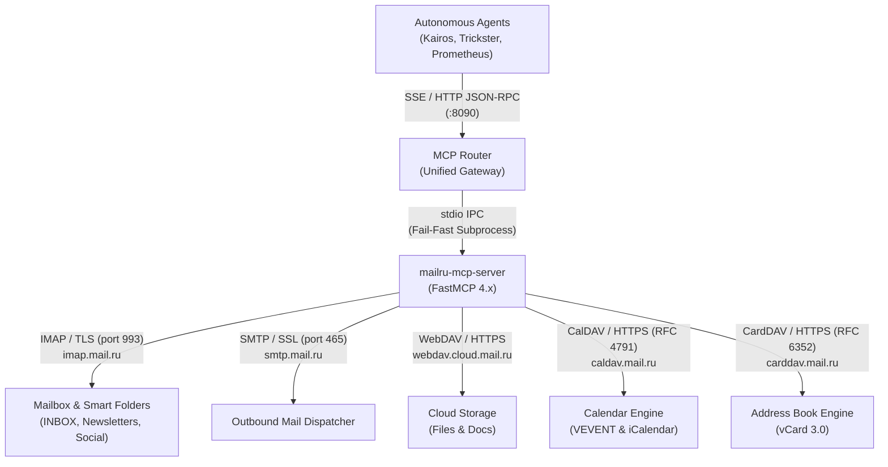
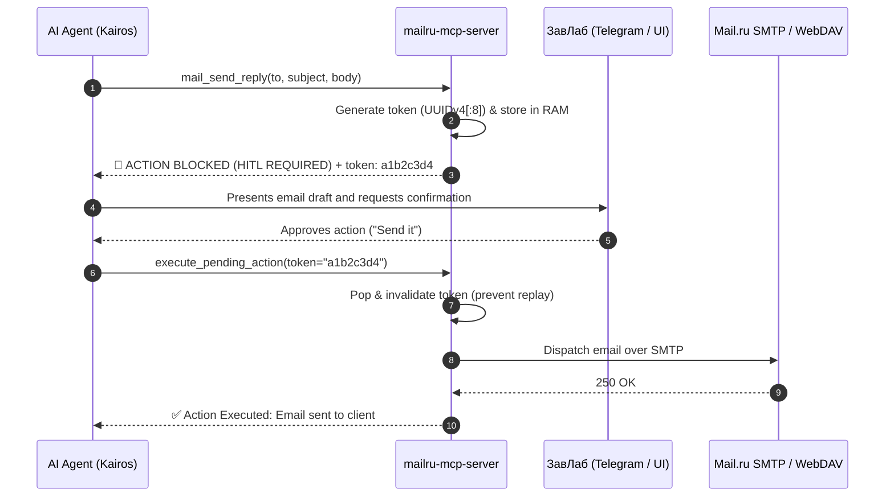

# 🏛️ Architecture Decision Record & System Design

**Repository:** `TheNovaNodes/mailru-mcp-server`  
**Status:** Approved & Implemented in Production  
**Lead Architects:** Kairos & ЗавЛаб  

---

## 1. System Topology & Context

The `mailru-mcp-server` acts as an isolated, stateless MCP execution engine for the Mail.ru infrastructure. Autonomous agents never connect directly to IMAP/SMTP or store credentials; instead, all interactions flow through the centralized `mcp-router` gateway.

---

## 2. Core Architectural Decisions (ADR)

### ADR-1: Stateless Execution & In-Memory Two-Phase Commit
* **Context:** AI agents executing autonomously could potentially send incorrect emails, move critical messages, or delete documents.
* **Decision:** The MCP server holds zero persistent database state (no SQLite/PostgreSQL). Any mutating/destructive action generates a cryptographically random 8-character token stored in volatile RAM (`PENDING_ACTIONS`).
* **Consequence:** Destructive operations cannot complete in a single turn. The action is blocked (`R3/R4 Risk`), requiring ЗавЛаб to review the payload and the agent to provide the confirmation token via `execute_pending_action`.

### ADR-2: Multi-Folder IMAP Aggregation & Timezone Normalization
* **Context:** Mail.ru automatically routes marketing, social, and system emails into smart subfolders (`INBOX/Newsletters`, `INBOX/Social`, `INBOX/News`, `INBOX/Receipts`). Standard IMAP clients checking only `INBOX` are blind to incoming notifications. Furthermore, emails from different senders have mixed timezone-aware and timezone-naive headers.
* **Decision:** 
  1. When `folder="INBOX"` and `include_smart_folders=True`, the server queries all designated smart subfolders.
  2. All message timestamps are parsed and converted to UTC via `_normalize_date(dt)` before sorting descending, preventing Python `TypeError: can't compare offset-naive and offset-aware datetimes`.
  3. IMAP reads execute with `mark_seen=False` to preserve unread flags for human triage.

### ADR-3: Strict Path Traversal Defense
* **Context:** Automated agents downloading files from WebDAV into the local workspace could be exploited via directory traversal (`../../etc/passwd`).
* **Decision:** The `dav_download_file` tool uses `os.path.commonpath([base_dir, target_path]) == base_dir` validation. If the target path resolves outside the current working directory, the operation is rejected immediately with a security error.

### ADR-4: Process Isolation & Secrets Handling
* **Context:** Plaintext credentials committed to Git present a catastrophic security risk.
* **Decision:** Credentials (`MAILRU_USERNAME`, `MAILRU_APP_PASS`) are injected solely via process environment variables from `/root/projects/TheNovaNodes/mcp-router/.env` (`chmod 600`, `.gitignore`). The server code and repository configurations only reference environment variables.

---

## 3. Protocol Implementation Matrix

| Protocol | Port / Scheme | Standard | Client Engine | Purpose |
|----------|---------------|----------|---------------|---------|
| **IMAP4rev1** | 993 / SSL | RFC 3501 | `imap_tools` | Reading inbox, smart folders, body extraction, thread search, draft saving via `APPEND`. |
| **SMTP** | 465 / SSL | RFC 5321 | `smtplib.SMTP_SSL` | Dispatching outbound messages and WebDAV file attachments. |
| **WebDAV** | 443 / HTTPS | RFC 4918 | `webdavclient3` | Document storage, directory scaffolding, asset downloads. |
| **CalDAV** | 443 / HTTPS | RFC 4791 | `requests` (XML/iCal) | Schedule inspection via `REPORT` calendar-query, meeting creation via `PUT`. |
| **CardDAV** | 443 / HTTPS | RFC 6352 | `requests` (XML/vCard) | Contact lookup via `REPORT` addressbook-query, lead creation via `PUT`. |
| **MCP** | stdio | JSON-RPC 2.0 | `FastMCP` | Standardized agent interface multiplexed by `mcp-router`. |

