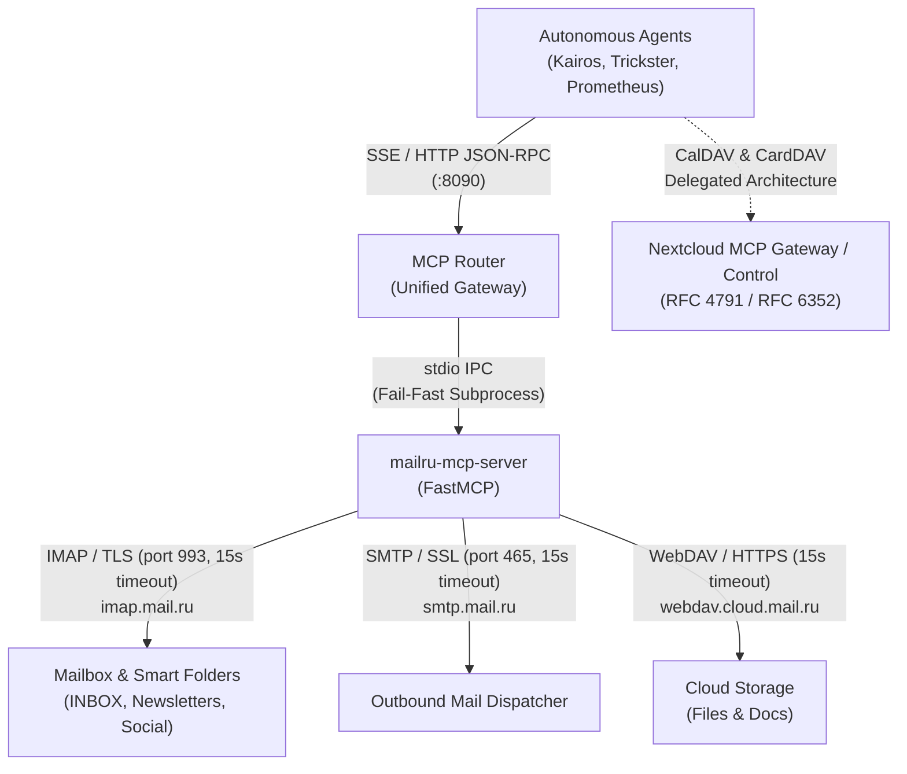
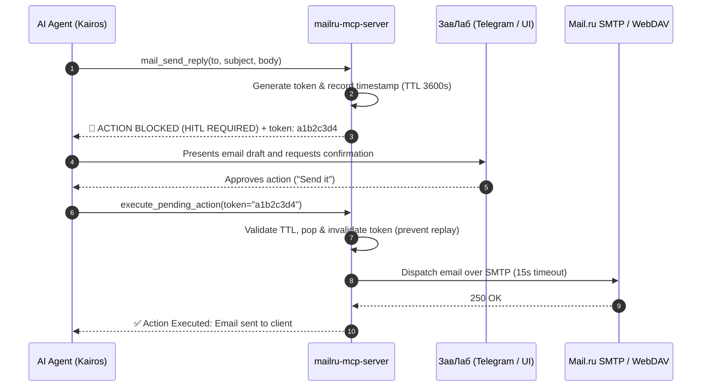

# 🏛️ Architecture Decision Record & System Design

**Repository:** `TheNovaNodes/mailru-mcp-server`  
**Status:** Approved & Implemented in Production  
**Lead Architects:** Kairos & ЗавЛаб  

---

## 1. System Topology & Context

The `mailru-mcp-server` acts as an isolated, stateless MCP execution engine for the Mail.ru infrastructure. Autonomous agents never connect directly to IMAP/SMTP or store credentials; instead, all interactions flow through the centralized `mcp-router` gateway.

---

## 2. Core Architectural Decisions (ADR)

### ADR-1: Stateless Execution, TTL & Two-Phase Commit (HITL)
* **Context:** AI agents executing autonomously could potentially send incorrect emails, move critical messages, or delete documents.
* **Decision:** The MCP server holds zero persistent database state (no SQLite/PostgreSQL). Any mutating/destructive action generates a cryptographically random token stored in volatile RAM (`PENDING_ACTIONS`) with a sliding 3600-second TTL and automatic eviction when capacity (`MAX_PENDING_ACTIONS = 100`) is reached.
* **Consequence:** Destructive operations cannot complete in a single turn. The action is blocked (`R3/R4 Risk`), requiring ЗавЛаб to review the payload and the agent to provide the confirmation token via `execute_pending_action`. Memory leaks are prevented via TTL pruning.

### ADR-2: Multi-Folder IMAP Aggregation & Timezone Normalization
* **Context:** Mail.ru automatically routes marketing, social, and system emails into smart subfolders (`INBOX/Newsletters`, `INBOX/Social`, `INBOX/News`, `INBOX/Receipts`). Standard IMAP clients checking only `INBOX` are blind to incoming notifications. Furthermore, emails from different senders have mixed timezone-aware and timezone-naive headers.
* **Decision:** 
  1. When `folder="INBOX"` and `include_smart_folders=True`, the server queries all designated smart subfolders.
  2. All message timestamps are parsed and converted to UTC via `_normalize_date(dt)` before sorting descending, preventing Python `TypeError: can't compare offset-naive and offset-aware datetimes`.
  3. IMAP reads execute with `mark_seen=False` to preserve unread flags for human triage.

### ADR-3: Workspace Allowed-Roots Path Traversal Defense
* **Context:** Automated agents downloading files from WebDAV into local workspaces could be exploited via directory traversal (`../../etc/passwd`). Conversely, restricting downloads strictly to the server's process working directory breaks autonomous agents running with different CWDs across the ecosystem.
* **Decision:** The `dav_download_file` tool strictly validates that the resolved target path is contained within designated operational roots:
  - `/root/.agents` (Agent Offices and workspaces)
  - `/root/projects` (Ecosystem repositories)
  - `/tmp` (Transient buffers)
  Any destination resolving outside these roots is rejected immediately with a security violation.

### ADR-4: Fail-Safe Network Timeouts (Zero-Deadlock Directive)
* **Context:** Unbounded network sockets in IMAP, SMTP, or WebDAV clients can hang indefinitely upon network partition or server tarpits, blocking the FastMCP process and stalling agent queues.
* **Decision:** All socket and HTTP operations enforce an explicit 15-second timeout (`MAILRU_TIMEOUT=15`). No connection may block without a deadline.

### ADR-5: Delegation of Calendar & Contacts to Nextcloud
* **Context:** Mail.ru does not provide a functional public CalDAV server (DNS resolves to unanswering endpoints), and its CardDAV implementation returns `501 Not Implemented` for contact creation via `PUT`.
* **Decision:** To uphold strict technical honesty and eliminate mock illusions, CalDAV and CardDAV modules are completely removed from `mailru-mcp-server`. Calendar and Address Book management across TheNovaNodes ecosystem are delegated natively to Nextcloud (`nextcloud-mcp-control` and `nextcloud-gateway`).

---

## 3. Protocol Implementation Matrix

| Protocol | Port / Scheme | Standard | Client Engine | Purpose |
|----------|---------------|----------|---------------|---------|
| **IMAP4rev1** | 993 / SSL | RFC 3501 | `imap_tools` (timeout=15s) | Reading inbox, smart folders, body extraction, thread search, draft saving via `APPEND`. |
| **SMTP** | 465 / SSL | RFC 5321 | `smtplib.SMTP_SSL` (timeout=15s) | Dispatching outbound messages and WebDAV file attachments. |
| **WebDAV** | 443 / HTTPS | RFC 4918 | `webdavclient3` (timeout=15s) | Document storage, directory scaffolding, asset downloads with workspace containment. |
| **MCP** | stdio | JSON-RPC 2.0 | `FastMCP` | Standardized agent interface multiplexed by `mcp-router`. |

